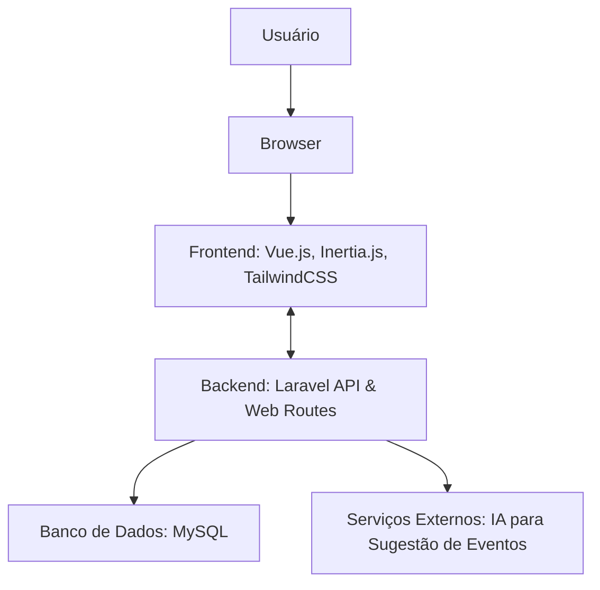

# StartupConnect

### *Conecte. Cresça. Prospere.*

**URL do Projeto:** [https://startupconnect.natanfiuza.dev.br](https://startupconnect.natanfiuza.dev.br)

## Descrição

**StartupConnect** é uma plataforma de networking social projetada para o ecossistema de startups. Nossa missão é conectar fundadores, aspirantes a empreendedores e investidores, permitindo que construam redes de contato valiosas com base em localização, setor de atuação e estágio de financiamento.

A plataforma visa ser o ponto de encontro central para a comunidade de inovação, oferecendo ferramentas para compartilhamento de conhecimento, descoberta de eventos e comunicação direta, impulsionando o crescimento e o sucesso de novas startups.

## Diagrama do Projeto

Este diagrama ilustra a arquitetura de alto nível do StartupConnect.



## Funcionalidades Principais

  * **Networking Inteligente:** Conecte-se com outros fundadores filtrando por localização, setor e estágio de financiamento.
  * **Perfis de Membros:** Crie e personalize seu perfil para destacar sua startup, suas habilidades e seus objetivos.
  * **Sistema de Conexões:** Siga outros membros para acompanhar suas atualizações e atividades.
  * **Feed de Notícias:** Publique atualizações, conquistas, perguntas e pensamentos através de posts com texto, imagens e vídeos.
  * **Mensagens Diretas:** Comunique-se de forma privada e segura com suas conexões.
  * **Mural de Eventos (BBS):** Publique e descubra eventos relevantes para a comunidade, desde meetups locais a conferências globais.
  * **Descoberta de Eventos com IA:** Uma funcionalidade que busca na web e sugere eventos relevantes com base no perfil e nos interesses do usuário.

## Tecnologias Utilizadas

Abaixo está a lista das principais tecnologias e bibliotecas que formam a espinha dorsal do StartupConnect. Esta lista será atualizada conforme o projeto evolui.

| Tecnologia       | Fonte                                       | Descrição                                                                                                                                     | Prós / Contras                                                                                                                            | Motivo da Escolha                                                                                                                                     |
| :--------------- | :------------------------------------------ | :-------------------------------------------------------------------------------------------------------------------------------------------- | :---------------------------------------------------------------------------------------------------------------------------------------- | :---------------------------------------------------------------------------------------------------------------------------------------------------- |
| **PHP**          | [php.net](https://www.php.net/)             | Linguagem de programação robusta e amplamente utilizada para desenvolvimento web no lado do servidor.                                         | **+:** Vasto ecossistema, maduro, ótima documentação. \<br\> **-:** Sintaxe pode ser inconsistente em versões mais antigas.               | É a base do Laravel, oferecendo performance e uma enorme comunidade de suporte.                                                                       |
| **Laravel**      | [laravel.com](https://laravel.com/)         | Framework PHP elegante e moderno com um ecossistema completo para construir aplicações web do zero.                                           | **+:** Ecossistema rico (Artisan, Eloquent, etc.), desenvolvimento rápido, segurança. \<br\> **-:** Curva de aprendizado para iniciantes. | Permite um desenvolvimento ágil e estruturado, ideal para a complexidade do projeto, com ferramentas que aceleram a implementação de funcionalidades. |
| **MySQL**        | [mysql.com](https://www.mysql.com/)         | Sistema de gerenciamento de banco de dados relacional de código aberto mais popular do mundo.                                                 | **+:** Confiável, rápido, bem documentado. \<br\> **-:** Menos flexível que bancos NoSQL para dados não estruturados.                     | Sua confiabilidade e performance são perfeitas para armazenar os dados estruturados da nossa aplicação (usuários, posts, eventos).                    |
| **Vue.js**       | [vuejs.org](https://vuejs.org/)             | Framework JavaScript progressivo para construir interfaces de usuário interativas e reativas.                                                 | **+:** Curva de aprendizado suave, reatividade, ótima performance. \<br\> **-:** Ecossistema menor em comparação com o React.             | Sua sintaxe limpa e a integração perfeita com o Laravel através do Inertia.js permitem criar uma experiência de usuário moderna e rápida.             |
| **Inertia.js**   | [inertiajs.com](https://inertiajs.com/)     | A "cola mágica" que conecta um back-end monolítico (Laravel) a um front-end moderno (Vue.js) sem a necessidade de construir uma API complexa. | **+:** Mantém a sensação de uma SPA com a simplicidade do desenvolvimento monolítico. \<br\> **-:** Acoplamento entre front e back.       | É o pilar da nossa arquitetura, permitindo um desenvolvimento extremamente produtivo e organizado.                                                    |
| **Tailwind CSS** | [tailwindcss.com](https://tailwindcss.com/) | Framework CSS utility-first para criar designs customizados rapidamente sem sair do HTML.                                                     | **+:** Altamente customizável, design rápido, consistência visual. \<br\> **-:** Classes podem "poluir" o HTML.                           | Ideal para o visual moderno e minimalista que buscamos, permitindo construir a UI de forma ágil e consistente.                                        |
| **Vite**         | [vitejs.dev](https://vitejs.dev/)           | Ferramenta de build de front-end de nova geração que oferece uma experiência de desenvolvimento extremamente rápida.                          | **+:** Hot Module Replacement (HMR) quase instantâneo, rápido. \<br\> **-:** Ecossistema de plugins mais novo.                            | O Laravel utiliza o Vite por padrão para compilar os assets, garantindo um ambiente de desenvolvimento ágil e responsivo.                             |

## Como Começar

Siga um dos tutoriais abaixo para configurar o ambiente de desenvolvimento em sua máquina local.

### Opção 1: Ambiente com Laragon (Recomendado)

1.  **Clone o repositório:**
    ```bash
    git clone https://github.com/natanfiuza/startup_connect_web.git
    ```
2.  **Navegue até a pasta do projeto:**
    ```bash
    cd startup_connect_web
    ```
3.  **Crie seu arquivo de ambiente:**
    ```bash
    cp .env.example .env
    ```
4.  **Instale as dependências do PHP:**
    ```bash
    composer install
    ```
5.  **Gere a chave da aplicação:**
    ```bash
    php artisan key:generate
    ```
6.  **Instale as dependências do JavaScript:**
    ```bash
    npm install
    ```
7.  **Configure o banco de dados:**
      * Abra o Laragon, clique em "Banco de Dados" e crie um novo banco de dados chamado `startup_connect_web`.
      * O arquivo `.env` já vem pré-configurado para o Laragon (`DB_USERNAME=root`, `DB_PASSWORD=` em branco).
8.  **Execute as migrations para criar as tabelas:**
    ```bash
    php artisan migrate
    ```
9.  **Compile os assets de front-end:**
    ```bash
    npm run dev
    ```
10. **Acesse o projeto** no seu navegador pela URL: `http://startup_connect_web.test`

### Opção 2: Ambiente Manual (PHP, MySQL, Node.js)

1.  **Clone o repositório:**
    ```bash
    git clone https://github.com/natanfiuza/startup_connect_web.git
    ```
2.  **Navegue até a pasta do projeto:**
    ```bash
    cd startup_connect_web
    ```
3.  **Crie seu arquivo de ambiente e gere a chave:**
    ```bash
    cp .env.example .env
    php artisan key:generate
    ```
4.  **Configure o arquivo `.env`:** Abra o arquivo `.env` e insira as credenciais do seu banco de dados MySQL local.
5.  **Crie o banco de dados:** Use sua ferramenta de preferência para criar um banco de dados chamado `startup_connect_web`.
6.  **Instale as dependências:**
    ```bash
    composer install
    npm install
    ```
7.  **Execute as migrations:**
    ```bash
    php artisan migrate
    ```
8.  **Inicie os servidores (em dois terminais separados):**
      * Terminal 1: `php artisan serve`
      * Terminal 2: `npm run dev`
9.  **Acesse o projeto** no seu navegador pela URL: `http://localhost:8000`

## Como Contribuir

Contribuições são o que tornam a comunidade de código aberto um lugar incrível para aprender, inspirar e criar. Qualquer contribuição que você fizer será **muito apreciada**.

### Fork & Pull Request

1.  **Faça um Fork** do projeto clicando no botão "Fork" no canto superior direito.
2.  **Clone o seu fork** para a sua máquina: `git clone https://github.com/seu-usuario/startup_connect_web.git`
3.  **Crie uma Branch** para a sua nova funcionalidade: `git checkout -b feature/MinhaNovaFeature`
4.  **Faça suas alterações** e realize o commit: `git commit -m 'Adiciona MinhaNovaFeature'`
5.  **Envie para a sua Branch** no seu fork: `git push origin feature/MinhaNovaFeature`
6.  **Abra um Pull Request** no repositório original.

### Regras para Issues e Pull Requests

  * **Issues:** Use as issues para reportar bugs ou sugerir novas funcionalidades. Seja claro e detalhado, fornecendo passos para reproduzir o problema, se aplicável.
  * **Pull Requests (PRs):**
      * Certifique-se de que seu código segue os padrões do projeto.
      * Mantenha os PRs pequenos e focados em uma única funcionalidade ou correção.
      * Descreva claramente o que o seu PR faz e por quê.
      * Se o seu PR resolve uma issue aberta, mencione o número da issue na descrição (ex: `Resolves #123`).

## Autor

**Nataniel Fiuza**

  * Email: [contato-startupconnect@natanfiuza.dev.br](mailto:contato-startupconnect@natanfiuza.dev.br)
  * Site: [https://natanfiuza.dev.br](https://natanfiuza.dev.br)
  
## Agradecimentos e Pedido de Contribuição

Obrigado por se interessar pelo StartupConnect\! Este é um projeto construído com a paixão de fortalecer o ecossistema de inovação. Se você é um desenvolvedor, designer, ou apenas um entusiasta, sua ajuda é bem-vinda para tornar esta plataforma ainda melhor.

Sinta-se à vontade para abrir uma issue, enviar um pull request ou simplesmente compartilhar suas ideias\!
